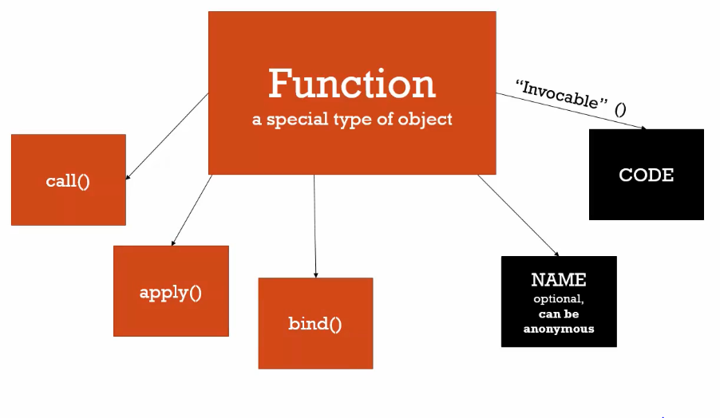

Syntax Parser: A program that reads your code and determines what it does
and if its grammar its valid. Your code is being translated to machine language by the compiler

Lexical Environment: Where something sits physically in the code you write
    Lexical means having to do with words or grammar. A lexical Environment exists in which
    WHERE you write someting is important (where its written and what surrounds it)

Execution Context: A wrapper to help manage the code that is running.
    There are lots of lexical environments. Which one is currently running is managed via
    execution contexts. It can contain things beyond what you've written in your code.

Name/Value Pair: A name which maps to a unique value. The name may be defined more than once,
but only can have one value in any given CONTEX. THat value may be more name/value pairs.

Object: A collection of name value pairs. The simplest definition when talking about JS
    Address:
    {
        Street: 'Main',
        Number: 100,
        Apartment:
        {
            Floor: 3,
            Number: 301
        }
    }

Global: Not inside a function

Javascript Undefined: A value that means the variable hasn't been set/initially set by JS

Single threaded: One command is executed at a time. Under the hood of the browser...maybe not.

Synchronous: One at a time and IN ORDER

Invocation: Running a function. Every time a function is called, a new execution context
is created for that function

If you run the code below...

THe conctexts in the execution stack are then popped off

Variable Environment: Where the variables live and how they relate to each other in memory. Every execution context has its own variable environment

function b() {
    console.log(myVar);
}

function a() {
    var myVar = 2;
    b();
}

var myVar = 1;
a();

Scope: Where a variable is available in your code and if it's truly the same variable, or a new copy

Keyword "let" allows you to perform block scoping

Asynchronous: More than one at a time

Event Queue won't be processed until the execution stack is empty

Javascript has Dynamic Typing: YOu don't tell the engine what type of data
a variable holds. It figures it out while your code is running. Values can hold different types of values because it's all figured out during execution.

var isNew = true; //not errors
isNew = "yup";
isNew = 1;

Primitive Types:

Number (Floats)
Booleans (True or False)
String ('' or "" can be used)
undefined : represents a lack of existence
null: represents lack of existence(you can set a variable equal to nothing using null)

Operator: A special function that is syntactically (written) differently. Generally, operators take two paramters and one result

EX:

var a = 3 + 4;
console.log(a)

//+ sign is an operator and is actually a funciton
/*
function +(a,b) {
    return // add the two numbers
}

infix notation allows us to call the function like this
    3 + 4

Operator Precedence: Which operator function gets called first. Functions are called in order of precedence (Higher precedence wins)

Operator Associativity: What order operator functions get called in: Left-to-right or right-to-left. When functions have the SAME precedence.

Coercion: Converting a value from one type to another. This happens often because JS is dynamically typed

var a = 1 + '2';
console.log(a)   //12

number 1 is coerced into a string '1' so this happens var a = '1' + '2'

Comparison operators

console.log(3<2<1); //evalutes to true

< operator is left to right associative

3<2 evalues to false

false < 1  /// false is coerced into 0. Can see this doing Number(false)

0<1   is true

Not all coercisions are gonna be correct though
Number(undefined) yiled NaN, Number(undefined) yields 0

Avoid that coercion stuff by using STRICT equality

3 === 3 true
"3" === "3" true
"3" === 3 false      different type, so not equal

Objects and the dot

Objects and their properties and methods are created in memory using any of the various syntax

var person = new Object(); //Do not do it this way

Object literal ---> var person = {};  shorthand for above

Can set up properties and methods using object literals

var person = {
    firstname: "tony",
    lastname: "Pony"
}

Namespace: A container for variables and functions. Typically to keep variables and functions with the same name separate

JS doesn't have namespaces

You can mimic it though
var greet = "Hello!";
var greet = "Hola!";

console.log(greet); yiels Hola!

var english = {
    greetings: {
        basic: "Hello!"
    }
};

var spanish = {}

spanish.greet = 'Hola!';

console.log(english)

Functions are Objects

First Class Function: Everything you can do with other types, you can do with functions. Assign them to variables, pass them around, create them on the fly.

Code that you write for a function is stored in a special property called Code of the Function object. The Code property is Invocable ()

Function Statements and Function Expressions

Expression: A unit of code that results in a value. It doesn't have to save to a variable

Statements just does work

Function Expression (An annonymous function)

Conceptual Aside: By value vs By Reference

These two values become the same by copying the value into 2 separate spots in memory

All objects (functions are objects too) are by reference

Mutate: To Change something. "Immutable" means cannot be changed

Objects, Functions, and this

Conceptual Aside: Arrays

Can put whatever you want in an array. Each element can be a different type because JS is dynamically typed.

'arguments' and SPREAD

Arguments hold all the values(parameters) you passed to the function. JS gives you a keyword of the same name which contains them all.

Whitespace: Invisible characters that create a literal 'space' in your written code. Carriage returns, tabs, spaces.

Immediately Invoked Function Expressions (IIFE)s Lecture 44

IIFEs and Safe Code Lecture 45

Understanding Closures Lecture 46

When the code starts, we have our Global Execution Context

When we hit var sayHi = greet('Hi');
It invokes the greet function and creates a new execution context

The variable that is passed to it, is sitting in its variable environment. Creates a function on the fly and returns it. After the return, the greet execution context is popped off the stack

At the moment the context finishes, the memory space is still there (whattosay)

Now we are in Global Execution Context again and invoke the function sayHi is pointing at. It's annonymous. THen that creates a new execution context.

When you hit the console.log line and its code is invoked, and JS engine sees the whattosay variable, it goes up the scope chain to look for that variable since it could not find it inside the function itself via outer lexical reference

Even though the greet function ended, any functions created inside of it when they are called, will still have a reference to that greet function's memory. TO what was in its memory, its execution context memory space.

Greet is gone, the execution context is gone, but what's in memory for that execution context isn't and the JS engine makes sure that my function can still go down the scope chain and find it, even if it is not on the execution stack anymore

when you hit this return arr; what's in memory is that i = 3 and arr holds 3 functions [f0,f1,f2]

Then we go back to the Global execution context and buildFunctions() execution context is popped off the stack. What's in memory is still hanging around.

When we hit fs[0](); and execute it. The code property says to console.log(i). Using the outer reference, it goes up the scope chain. i was created in buildfunctions and it's value is 3.

The same thing happens to the rest of the functions. They go to the same spot in the scope chain because they were created in buildFunctions()

Framwork Asides: Function Factories Lecture 48

When we reach var greetEnglish = makeGReeting('en'), it creates a new execution context

Then it returns a function that is now stored in greetEnglish, it's pointing to that function, and makeGreeting('en) is popped

When we reach var greetSpanish = makeGreeting('es') ... we get a new execution context and that returns a new function object stored in greetSpanish and is then popped

Now we have 2 spots in memory that are hanging out that those 2 separate contexts once contained

When we hit greetEnglish, it creates a new execution context with firstname = John, lastname = Doe

The outer environment reference needs to point to to one of the exectiion contexts created by makeGReeting cause that's where it sits lexically.

JS engine knows that the first context was created during the first execution context. So it points to the one it was created inside of

WHen you hit greetSpanish, it generates it's own context, but that function object was created to the second call to makeGreeting. So it's outer reference points to the second execution context that was created for that second call.

CLosures and Callbacks

Callback Function: A function you give to another function, to be run when the other function is finished. So the function you call (invoke), 'calls back' by calling the function you gave it when it finishes

Call(), Apply(), and Bind()

Function Currying: Creating a copy of a function but with some preset parameters. Very useful for math functions

Functional Programming (LISP, ML) Lecture 51

Object Oriented JS and Prototypical Inheritance

Inheritance: One object gets access to the properties and methods of another object (JS)

Classical: C#, Java. Most popular way inheritance has been done. Verbose.

Prototypical inheritance: Simple -> flexibible, extrensible, easy to understand?

Understanding the Prototype

ALl objects have a prototype property. It is simply a reference to another object (called proto in our example)

Prototype Chain - Looking for where we have access to a prop or method amongst a sequence of objects that are connected via this prototype property that we are called proto. It's hidden in that you don't have to go obj.proto.proto.prop3 to get prop3

If you have another object, obj2, it can point to the same object as it's prototype

obj2 shares a property with obj but not directly instead via the prototype chain

Everything is an object (or a primitive) Lec55

The built in core object is at the bottom of the prototype chain

Reflection and Extend Lec56

Reflection: An object can look at itself, listing and changing and its properties and methods. You can use to implement a pattern called EXTEND (composition)

Lec 57

Function COnstructors: A normal function that is used to construct objects. The 'this' variable points to a new empty object and that object is returned from the function automatically

Lec58 Function Constructors and .prototype

When you use a function constructor, it already set the prototype for you

Anytime you create a function object, you get special properties: prototype being one of them. It lives only for when you're using a function as a function constructor.

The prototype property on a function, is NOT the prototype of the function. It's the prototype of any objects created if you're using the function as a function constructor.

Dangerous Aside: New and Functions Lec 59

Any function we intend to be a function constructor, we use a capital letter for it's name

Lec60

var a = new Number(3)

yields an object that wraps and boxes up a number, not a primitive. It also has built in methods because protoype points to Number.prototype

In general, you should not use built in function constructors for primitive types unless you HAVE TO

Lec 62: Dangerous Aside: Arrays and for...in

Do not use for...in for an array

because arrays and objects and you can iterate all the way down to the prototype

Lec 63: Object.create and Pure Prototypal Inheritance

Polyfill: Code that adds a feature which the engine may lack. Checks to see if an engine has some feature. If not, we write some code to add those features it is missing.

ES6 and Classes

This class person is actually an object that is created. Then you are creating new objects from that object.

How to set prototype then? Using extends. That sets the prototype for any of your objects created with this class. Sets __proto__ property at least in Chrome. Super calls the constructor of the object that is your prototype.

Syntactic Sugar: A different way to TYPE something that doesn't change how it works under the hood

It's still prototypal inheritance